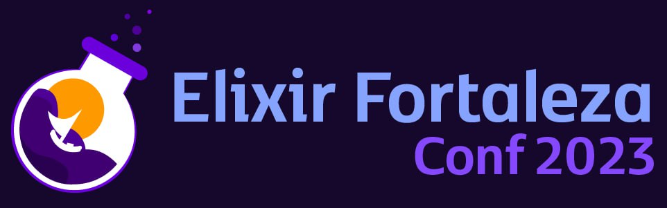

Uma conferência do [ecossistema de Erlang](https://erlef.org/), feita por [Elixir em Foco](http://elixiremfoco.com), [Elug CE](https://elug-ce.github.io/), DAINF e [PPGCA](https://ppgca.ct.utfpr.edu.br/) da [UTFPR](https://ppgca.ct.utfpr.edu.br/), [Departamento de Computação da UFC](https://dc.ufc.br/pt/) e [UFC Virtual](https://virtual.ufc.br/). Este é um evento [organizado](./organizacao.md) pela comunidade [Elixir](https://elixir-lang.org/).

- "Esquenta" do Elixir Fortaleza: 15 de setembro de 2023, à noite.
- Palestras: 21 e 22 de setembro de 2023, manhã e tarde (das 9h às 18h).

Local: Auditório do Departamento de Estatística e Matemática Aplicada (DEMA), Bloco 910 do Campus do Pici, Universidade Federal do Ceará (UFC). Fortaleza, Ceará. [Link para localização no Google Maps](https://maps.app.goo.gl/NaYqoxgS12xayjAq8).

Aguarde mais informações aqui ou no [perfil do Elixir em Foco no Twitter](https://twitter.com/elixiremfoco).

🇬🇧 [This page in English](http://elixiremfoco.github.io/elixirfortaleza/index_en)

## Programação

- Primeira palestra regular anunciada! [Processos em Elixir - Como funciona a arquitetura básica das aplicações Elixir, por Cairo Noleto](https://twitter.com/elixiremfoco/status/1691931458061873578/photo/1)
- Primeira keynote anunciada! [Pedro Castilho vai ministrar a palestra "O runtime Erlang e como torná-lo seu amigo"](https://twitter.com/elixiremfoco/status/1691131521175076865?s=20).

## Outras informações

[Saiba um pouco mais da história dos eventos da comunidade do ecossistema de Erlang no Brasil](./historia.md)

<!--  -->

